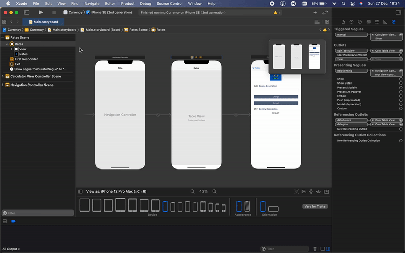

# ObjC-Currency
A Currency calculator built on Apple's Objective-C and UIKit Framework.

## Background History

Over the last two months I have been focussing on **iOS Development** with the old but well matured technologies, **ObjectiveC** and **UIKit**. 

Starting and finding good, and most importantly updated, online resources that could help me out to solve exercises was harder than actually creating the set of Apps, due to the fact after #Swift and #SwiftUI came out, developers seem to focus on this two other than **ObjectiveC** and **UIkit**.

Because of this, I decided to make some of these projects available on GitHub. Simple ones, but hope they can help newbies getting to know this technology 🤓 This time, a simple Currency app which consumes a RESTful API through a CocoaPod framework called **AFNetworking**!

***DISCLAIMER***: I am a beginner with these technologies, perhaps like some of you, so there might be some mistakes here and there. Use this project only as a reference, if you want to learn my approach to fetch external API's.

## External Frameworks

This project depends on AFNetworking framework. This an be installed as a [CocoaPod](http://cocoapods.org) package. To do such, type the following command on terminal

```
$ pod install
```

## APIs

Currency App uses Fixer external API to fetch exchange rates. You can get your API key on their [website](https://fixer.io). This key should be set on the Xcode project, under Scheme configuration, on the environment variable called *api_key*, as seen below. 



